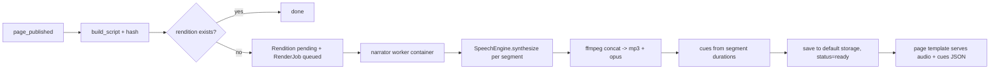

# Devcast — design for the devblog and audioblog content types

Status: phases 0-3 built, phases 4+ proposed
Target: semprini.me (Wagtail 7.4 / Django 6.0 / puput as plugin)

## 1. Goals

Two new content types on top of the existing puput blog:

1. **Dev project page** — a "steam store page for whatever I'm building": hero media, status,
   tech stack, links, feature/gallery blocks, and a **foldable change history**.
2. **Audio blog page** — long-form content with a narration track where the section (and any
   media) currently being spoken is highlighted, click-to-seek, and follow-along scrolling.
   Narration audio is **re-rendered automatically when the content changes** — an online TTS
   service now, a local voice-cloning model later.

Non-goals for v1: real-time TTS in the request cycle, phoneme-accurate lipsync, multi-language
narration.

Both types are built inside one Django app, `devcast`, structured from day one so it can be
lifted out into a standalone distribution (`wagtail-devcast`) the way puput packages the base
blog — see [§9](#9-extraction-to-a-standalone-library).

## 2. Constraints discovered in the existing codebase

These drive most of the decisions below.

| Fact | Where | Consequence |
| --- | --- | --- |
| `BlogPage.subpage_types = ["puput.EntryPage"]`, and `clean_subpage_models()` resolves *exact* classes (no subclass matching) and caches into `_clean_subpage_models` | [pages.py](.venv/lib/python3.14/site-packages/wagtail/models/pages.py#L1527-L1550) | New page types must be appended to `BlogPage.subpage_types` in `AppConfig.ready()` before the cache is warmed |
| `EntryPage.subpage_types = []`, `parent_page_types = ["puput.BlogPage"]` | [models.py](.venv/lib/python3.14/site-packages/puput/models.py#L144) | Subclasses inherit the right parent rule for free; changelog entries cannot be child pages |
| `BlogPage.get_entries()` returns `EntryPage.objects.descendant_of(self)` | [models.py](.venv/lib/python3.14/site-packages/puput/models.py#L32) | **Subclassing `EntryPage` (multi-table inheritance) makes the new types appear automatically in the blog list, archive, tag/category routes, search and RSS** |
| `EntryPageServe` routes via `site.root_page.specific.route(...)` then `page.serve(...)` | [views.py](.venv/lib/python3.14/site-packages/puput/views.py#L44-L50) | The specific subclass is served, so `/YYYY/MM/DD/slug/` URLs work unchanged for subclasses |
| `EntryAbstract.clean()` requires `body` or `markdown_body`; `save()` renders `markdown_body` → `body` | [abstracts.py](.venv/lib/python3.14/site-packages/puput/abstracts.py#L151-L159) | Markdown is the established authoring path; new blocks should offer `MarkdownBlock` for consistency |
| `Reaction`/`Comment` key on a plain `entry_page_id = IntegerField` | [models.py](app/feedback/models.py#L29) | Comments and reactions work on the new types with **zero changes** |
| Avatar exposes `window.__avatarDebug.speak(amplitude)` and `setExpression(partial)` | [avatar.js](app/static/js/avatar.js#L206-L228) | A `speak()` hook already exists — client-side amplitude lipsync is nearly free |
| three.js is vendored under `app/static/js/three.js/` and wired with an import map in [base.html](app/templates/puput/base.html#L46-L55) | | A GLB/model-viewer block for project pages costs no new dependencies |
| No Celery, no broker, no management commands anywhere in the repo | | Do **not** introduce a broker; use a DB-backed job table drained by a small worker container |
| `STORAGES` already points media at S3 with `public-read` and `max-age=86400` | [base.py](app/settings/base.py#L200-L215) | Rendered audio uses the default storage; content-addressed filenames let us cache forever |
| `feeds.py` already fixes `item_enclosure_length` for media enclosures | [feeds.py](app/feeds.py) | A real podcast feed for audio blogs is a cheap follow-on win |

### 2.1 Placement in the page tree

```
Site root
└── BlogPage  (puput)
    ├── EntryPage            existing posts
    ├── DevProjectPage       new — subclass of EntryPage
    └── AudioEntryPage       new — subclass of EntryPage
HomePage
└── DevProjectIndexPage      new — portfolio grid, queries projects site-wide
```

Both new types are **`puput.EntryPage` subclasses**. That single decision inherits URL routing,
sitemap entries, tags, categories, author/date archives, search indexing, comments, reactions
and RSS. Project pages therefore **do appear in the main chronological stream** (decided) —
"I shipped a thing" should hit the feed — but with a distinct card. `DevProjectPage` adds an
`updated` timestamp surfaced separately from `date`, so an evergreen page that was created in
2024 and revised last week reads correctly in both the stream and the portfolio grid.

`DevProjectIndexPage` is a *collection* page, not a tree parent: it lives under `HomePage` at
`/projects/` and queries `DevProjectPage.objects.live()` regardless of where they sit.

Enabling the subclasses (in `devcast/apps.py`):

```python
class DevcastConfig(AppConfig):
    name = "devcast"

    def ready(self):
        from puput.models import BlogPage
        for label in ("devcast.DevProjectPage", "devcast.AudioEntryPage"):
            if label not in BlogPage.subpage_types:
                BlogPage.subpage_types.append(label)
        BlogPage._clean_subpage_models = None   # drop any warmed cache
```

> `app/templates/puput/blog_page.html` currently renders plain `EntryPage` instances from
> `get_entries()`. Change that template to iterate `entries.specific()` so each new type can
> supply its own card partial (project → hero + status badge, audio → duration + play button).

## 3. Shared block library

`devcast/blocks.py` defines the content vocabulary used by both types. Every block implements a
narration contract so the audio pipeline never has to special-case markup.

```python
class NarratableMixin:
    """Blocks opt in to narration by returning plain text, or '' to be skipped."""
    def narration_text(self, value) -> str: ...
```

| Block | Narration behaviour |
| --- | --- |
| `MarkdownBlock` (from `wagtailmarkdown.blocks`, wrapped) | HTML stripped to plain text |
| `HeadingBlock` | Read verbatim, becomes a cue boundary and a chapter marker |
| `ImageBlock` (image, caption, `narration` override) | `narration` if set, else caption, else skipped |
| `GalleryBlock` | `narration` override only |
| `VideoBlock` / `EmbedBlock` | `narration` override only; player pauses narration on play |
| `CodeBlock` (language, code, `narration`) | **Never** auto-read; `narration` override only |
| `Model3DBlock` (GLB from a Wagtail document/collection) | `narration` override; reuses the vendored three.js import map |
| `CalloutBlock`, `QuoteBlock` | Read, with a leading `"Aside:"` / attribution |
| `NarrationBreakBlock` | Emits no visible markup; injects a pause or an aside line |

Each StreamField child already carries a stable UUID (`block.id`) that survives edits and
reordering. That id is the join key between rendered HTML (`data-cue-id`), the narration script
and the cue track. This is the backbone of the whole audio feature.

## 4. Dev project page

### 4.1 Models

```python
class ProjectStatus(models.TextChoices):
    CONCEPT = "concept", "Concept"
    PROTOTYPE = "prototype", "Prototype"
    ALPHA = "alpha", "Alpha"
    BETA = "beta", "Beta"
    RELEASED = "released", "Released"
    MAINTENANCE = "maintenance", "Maintenance"
    SHELVED = "shelved", "Shelved"


class DevProjectPage(EntryBase, Page):        # EntryBase resolves to puput.EntryPage
    tagline        = CharField(max_length=200)
    status         = CharField(choices=ProjectStatus, default=CONCEPT)
    started_on     = DateField(null=True, blank=True)
    updated        = DateTimeField(auto_now=True)
    hero_image     = FK(Image, null=True)
    hero_model     = FK(Document, null=True)   # optional GLB shown instead of the image
    repo_url       = URLField(blank=True)
    demo_url       = URLField(blank=True)
    download_url   = URLField(blank=True)
    stack          = ClusterTaggableManager(through="devcast.ProjectStackTag", blank=True)
    showcase       = StreamField(SHOWCASE_BLOCKS, blank=True)   # gallery, video, 3D, features
    # `body` (inherited) is the "About this project" long-form section


class ProjectLink(Orderable):                 # arbitrary extra links: itch.io, docs, paper…
    page  = ParentalKey(DevProjectPage, related_name="links")
    label, url, icon


class ProjectFeature(Orderable):              # the "why you'd care" bullet row
    page  = ParentalKey(DevProjectPage, related_name="features")
    icon, title, description


class RoadmapItem(Orderable):
    page  = ParentalKey(DevProjectPage, related_name="roadmap")
    title, state  # planned | in_progress | done | dropped


class ChangelogEntry(Orderable):
    page        = ParentalKey(DevProjectPage, related_name="changelog")
    version     = CharField(max_length=40, blank=True)     # "0.4.2", or blank for undated notes
    released_on = DateField()
    kind        = CharField(choices=[added, changed, fixed, removed, note])
    summary     = CharField(max_length=200)
    detail      = MarkdownField(blank=True)
    image       = FK(Image, null=True, blank=True)
    commit_url  = URLField(blank=True)
    related_entry = FK("puput.EntryPage", null=True, blank=True, on_delete=SET_NULL)
```

Changelog entries are **inline orderables, not child pages** — a release note is not a URL, and
`EntryPage.subpage_types = []` blocks child pages anyway. When a change deserves a full write-up,
`related_entry` links out to a normal blog post (or an audio blog post).

Admin editing is one screen: content panels group Hero / About / Showcase / Features / Roadmap,
with an `InlinePanel("changelog")` using `ChangelogEntry.version` as the panel heading.

### 4.2 Foldable history

`ChangelogEntry` rows are grouped by `version` in `get_context()` and rendered as native
`<details>` elements — no JS required for the core behaviour, which keeps it working with JS
disabled and printable:

```html
<ol class="changelog">
  
  <li>
    <details open data-version="{{ release.version }}">
      <summary>
        <span class="changelog__version">{{ release.version|default:"Notes" }}</span>
        <time datetime="{{ release.released_on|date:'c' }}">{{ release.released_on|date:"j M Y" }}</time>
        <span class="changelog__counts"><em class="tag tag--{{ k }}">{{ n }} {{ k }}</em></span>
      </summary>
      …entries, each with kind badge, summary, optional detail/image/commit link…
    </details>
  </li>
  
</ol>
```

Progressive enhancement in `devcast.js`: "expand all / collapse all", deep-linking
(`#v0.4.2` auto-opens and scrolls), and lazy-loading of releases beyond the first 10 via a
routable `?page=` fragment endpoint so pages with 200 releases stay light.

## 5. Audio blog page

### 5.1 Models

```python
class AudioEntryPage(EntryBase, Page):
    intro       = RichTextField(blank=True)
    sections    = StreamField(NARRATABLE_BLOCKS)      # the narrated content
    narration_enabled = BooleanField(default=True)
    manual_audio      = FK(Document, null=True, blank=True)   # bypass TTS entirely

    @property
    def narration(self):     # current ready rendition, or None
        ...


class Voice(models.Model):           # snippet — one active voice per site
    site       = FK(Site, related_name="narration_voices")
    key, label = ...
    engine     = CharField()         # "elevenlabs" | "openai" | "local_xtts"
    engine_voice_id = CharField()    # provider-side id / cloned-speaker id
    # The provider's own sliders, as real fields rather than hand-typed JSON.
    # Each is nullable: empty means "leave the provider's default alone".
    speed             = FloatField(null=True)   # 0.7 – 1.2
    stability         = FloatField(null=True)   # 0.0 – 1.0
    similarity_boost  = FloatField(null=True)   # 0.0 – 1.0
    style             = FloatField(null=True)   # 0.0 – 1.0
    use_speaker_boost = BooleanField(null=True)
    extra_settings    = JSONField(default=dict) # engine params with no field
    is_default = BooleanField(default=False)
    # NOTE: no API credentials here — those come from the environment only.

    @property
    def engine_settings(self):       # unset sliders are omitted, not defaulted
        ...

    class Meta:
        constraints = [UniqueConstraint(fields=["site"], condition=Q(is_default=True),
                                        name="devcast_one_default_voice_per_site")]


class Rendition(models.Model):
    page        = FK(Page, null=True, related_name="narrations")  # null for avatar utterances
    voice       = FK(Voice)
    script_hash = CharField(max_length=64, db_index=True)   # sha256 of the normalised script
    engine      = CharField(max_length=32)
    engine_rev  = CharField(max_length=64)     # model/version + hash of Voice.settings, so
                                               # engine upgrades and tuning tweaks invalidate
    status      = CharField(choices=[pending, rendering, ready, failed])
    audio       = FileField(upload_to=content_addressed_path)   # mp3 + opus
    duration_ms = IntegerField(null=True)
    cues        = JSONField(default=list)      # [{id, start, end, kind, text}]
    words       = JSONField(default=list)      # [[start, end, "word"], …] when available
    visemes     = JSONField(default=list)      # phase 5
    char_count  = IntegerField(default=0)
    cost_cents  = IntegerField(null=True)
    error       = TextField(blank=True)
    created_at  = DateTimeField(auto_now_add=True)

    class Meta:
        constraints = [UniqueConstraint(fields=["page", "voice", "script_hash", "engine_rev"],
                                        name="devcast_rendition_unique")]


class RenderJob(models.Model):
    rendition   = OneToOneField(Rendition)
    state       = CharField(choices=[queued, leased, done, failed, cancelled])
    leased_by, leased_until, attempts, last_error
```

**Voice defaults to the site, with a per-page override** (revised). There is one `is_default`
`Voice` per `Site`, following the pattern [Subtitle](app/semprini/models.py#L11) already uses, so
no new `INSTALLED_APPS` entry is needed. `AudioEntryPage.voice` is a nullable FK that an editor
can set when a particular post wants a different narrator; empty means "whatever the site says",
so changing the site voice still sweeps every page that never opted out. Resolution is
`page.voice or Voice.objects.get(site=Site.find_for_request(...), is_default=True)`, falling back
to `DEVCAST_DEFAULT_VOICE` for a library consumer with no snippet configured.

`Rendition` still carries a `voice` FK, and that FK is part of the uniqueness key. Switching the
site voice therefore does not destroy anything: old renditions stay on disk, every page renders
afresh under the new voice, and switching back is free. A `rerender_narrations --voice <key>`
command queues the whole site in one pass with the budget guard from [§7](#7-security-and-cost-controls)
still applied, so a voice change is a deliberate, costed operation rather than an accident.

### 5.2 Script extraction and change detection

```python
def build_script(page) -> list[Segment]:
    """[(block_id, kind, text)] — the single source of truth for narration."""

def script_hash(segments) -> str:
    return sha256("\x1f".join(f"{s.block_id}\x1e{normalise(s.text)}" for s in segments))
```

`normalise()` collapses whitespace and strips markup so cosmetic edits (a typo fix in a code
block, a re-ordered class attribute) do not burn TTS credits. Reordering blocks *does* change
the hash, because playback order changed.

On `page_published` (Wagtail signal / `after_publish_page` hook):

```
compute hash → rendition exists with (page, voice, hash, engine_rev)?
  ready   → nothing to do
  failed  → reset to pending, requeue (bounded attempts)
  missing → create Rendition(pending) + RenderJob(queued); cancel superseded queued jobs
```

Only **publish** triggers a render, never draft autosave — that alone removes most of the
duplicate-spend risk. The admin also gets an explicit "Render narration" button
(`devcast.render_narration` permission) for forcing a re-render after a voice change.

### 5.3 Rendering pipeline



**Segmented rendering is the default strategy**, and it is the key trick: synthesise one clip
per script segment, measure each clip's duration, then concatenate. Cue boundaries are then
exact *by construction* and work with **any** engine, including future local models that expose
no timing API. Engines that do return timings (ElevenLabs `with-timestamps`) additionally
populate `words` for word-level highlighting and viseme derivation.

**One clip per block, not per sentence** (decided). A block is the unit the reader clicks and the
unit the highlight moves over, so it is also the unit of synthesis — and it is the *largest* unit
that keeps cues exact, which matters because a TTS model reads a whole passage with one intonation
arc and restarts cold on every request. Per-sentence rendering would buy nothing and cost prosody.
Real content sits far inside the engine ceiling (`eleven_multilingual_v2` accepts 10,000 characters
per request, and is documented as most stable on long-form input); the converted
`architecting_data_autonomy` post is 15 blocks with a median of 658 and a maximum of 1,641
characters, so `DEVCAST_MAX_SEGMENT_CHARS = 5000` never splits it. Splitting only ever happens on
sentence boundaries, and the pieces are merged back into one cue.

The seam between clips is handled rather than hidden: each generation is sent `previous_text` and
`next_text` — the neighbouring blocks, which are not spoken — so the model knows where the passage
sits and the stitched article is read as one continuous piece.

**Links are read as their text, never their URL.** `narration_text()` strips markup before the
script is built, so a markdown link contributes only its label. The residual case is a URL an
author wrote *as* the visible text (an autolink or a pasted address); `to_speech()` reduces those
to the bare host with its dots spoken, because a path read character by character is
unlistenable.

Engine abstraction:

```python
class SpeechEngine(Protocol):
    name: str
    revision: str
    def synthesize(self, text: str, voice: Voice) -> Clip:  # audio bytes, mime, duration, words
```

**ElevenLabs is the phase-3 engine** (decided). It is the only realistic option that returns
character-level timestamps, which is what makes word-level highlighting and the phase-5 viseme
track possible without a forced-alignment stage:

```python
class ElevenLabsEngine:
    name, revision = "elevenlabs", "eleven_multilingual_v2"
    endpoint = "/v1/text-to-speech/{voice_id}/with-timestamps"
    output_format = "mp3_44100_128"

    def __init__(self):
        self.api_key = os.environ["ELEVEN_LABS_API_KEY"]   # from .env.prod; fail fast if absent
```

The response carries `audio_base64` plus `alignment.characters` /
`character_start_times_seconds`, which collapse to the `words` array in the cue track. Voice
tuning (stability, similarity boost, style) rides in `Voice.settings` and is passed through
verbatim, so tweaking the delivery never needs a code change — but it *does* change
`engine_rev`-adjacent output, so `Voice.settings` is folded into the rendition uniqueness key
alongside `script_hash`.

Other implementations: `OpenAITTSEngine` (cheaper, timing-blind — kept as a fallback that
segmented rendering already covers) and `LocalHTTPEngine` (a sidecar container speaking a tiny
JSON API, with XTTS-v2 / F5-TTS / Piper behind it). Because the local engine is reached over the
same interface at `DEVCAST_ENGINES["local"]["base_url"]`, the eventual swap from ElevenLabs to a
cloned voice is a settings change plus one `rerender_narrations` pass, with no model, template or
JS change.

**Worker deployment** — a new `narrator` service in `docker-compose.yml` running the same image:

```yaml
narrator:
  build: ./app
  command: python manage.py render_narrations --loop --interval 30
  env_file: [.env.prod]          # supplies ELEVEN_LABS_API_KEY
  depends_on: [db]
```

`ELEVEN_LABS_API_KEY` lives in `.env.prod` and is read **only** by the worker — no code path in
the `web` container touches it. If the two services are later split onto separate env files, the
key should go to the narrator's alone; an internet-facing gunicorn process has no reason to hold
a billable credential.

The image does not currently contain **ffmpeg**, which the segment concatenation step needs.
Either add it to [app/Dockerfile](app/Dockerfile) or give the narrator its own image; the web
container has no use for it.

Job leasing uses `select_for_update(skip_locked=True)` plus a `leased_until` fence, so multiple
workers (or an accidental double-start) can never double-spend on a synthesis. No broker, no
Celery, consistent with how `backupdb` is already deployed.

### 5.4 Cue track format

Served as an inline `<script type="application/json">` (small — a few KB) rather than a second
request:

```json
{
  "version": 1,
  "audio":   { "mp3": "…", "opus": "…", "duration": 412.34 },
  "voice":   "semprini-v1",
  "hash":    "9f3c…",
  "cues":    [ { "id": "b1a2-…", "start": 0.0,  "end": 12.4, "kind": "heading" },
               { "id": "c7f0-…", "start": 12.4, "end": 58.9, "kind": "markdown" } ],
  "words":   [ [12.40, 12.62, "The"], [12.62, 12.94, "avatar"] ],
  "visemes": [ [12.40, "AA"], [12.52, "sil"] ]
}
```

### 5.5 Player and highlighting

`app/static/js/audioblog.js` (ES module, ~200 lines, no framework):

- Sticky player bar: play/pause, scrubber, speed, skip-to-next-section, mute.
- Each block renders as `<section data-cue-id="{{ block.id }}">`. On `timeupdate` a binary
  search over `cues` finds the active id; the module toggles `.is-narrating` and sets
  `aria-current="true"`. Word-level `<mark>` spans are wrapped lazily only for the active cue,
  and only when `words` is present.
- Click any section → seek to its cue start. Sections are `tabindex="0"` with an Enter/Space
  handler, so keyboard users get the same affordance.
- **Chapter permalinks** (decided). Every cue section renders as
  `<section id="cue-{{ block.id }}" data-cue-id="{{ block.id }}">`, and heading blocks also get a
  slug alias (`id="c-the-avatar-rig"`) so shared links are readable. A hover anchor (`#`) copies
  the URL. On load, a matching `location.hash` scrolls to the section, marks it active and
  **primes** the player at that cue's start time; playback itself waits for a click, because
  browsers block unprompted audio anyway and silent autoplay from a shared link would be hostile.
  `?t=<seconds>` is honoured the same way for mid-cue links. Heading cues are also published as
  `navigator.mediaSession` chapters, so the same structure drives lock-screen skip.
  Security: the hash is resolved by `cues.find(c => c.id === raw)` — never by
  `querySelector('#' + raw)` or any `innerHTML` path — so a crafted fragment cannot become a
  selector- or markup-injection vector.
- Follow-along scroll uses `scrollIntoView({block:'center'})`, disabled when the reader has
  scrolled manually in the last 4s and always disabled under `prefers-reduced-motion`.
- Playing an embedded `VideoBlock` pauses narration and resumes on video end.
- Position is kept in `sessionStorage` keyed by rendition hash; `navigator.mediaSession`
  supplies lock-screen metadata and chapter markers from heading cues.
- **The page is the transcript.** No separate transcript view is needed, which makes the
  accessibility story fall out for free: audio is a pure enhancement over readable HTML.
- Fallback states: no rendition yet → hide the player, show nothing (the page still reads);
  rendition stale (`hash` mismatch) → play the previous one with a small "narration is being
  re-recorded" note.
- Seeking is deferred until the media element reports `HAVE_METADATA`, because `currentTime` is
  silently ignored before then — a reader who clicks a section while the audio is still loading
  would otherwise get no response at all. The highlight moves immediately regardless, so the
  click always feels answered. Seeking also needs the audio host to honour Range requests;
  Wagtail redirects documents to S3 in production, which does, but the local dev server does not.

### 5.6 Avatar lipsync

Staged, because the avatar API already gives us a cheap first step:

- **Phase 4 (amplitude).** `AudioContext` → `MediaElementSource` → `AnalyserNode`; per frame,
  compute RMS, smooth it, call `window.__avatarDebug.speak(rms)`. The existing
  `speak(amplitude)` hook in [avatar.js](app/static/js/avatar.js#L225) already drives the mouth
  scale, so this works today with no avatar changes. Add `setExpression` nudges on
  `CalloutBlock`/`QuoteBlock` cues for a bit of life.
- **Phase 5 (visemes).** Promote the debug object to a real module API —
  `import { speak, setViseme, setExpression } from './avatar.js'` — and add a viseme→mouth-shape
  map (Preston Blair set: AA, E, I, O, U, MBP, FV, L, WQ, etc.) driven by the precomputed
  `visemes` track. Generated offline in the worker from `words` + a grapheme-to-phoneme pass
  (`g2p-en` or the phoneme output of the local TTS model, which usually exposes it directly).
  Precomputing keeps the client cheap and makes the mouth *anticipate* sounds correctly, which
  amplitude alone can never do.
- **Avatar utterances.** A `Utterance` snippet (`key`, `text`, `trigger`, `voice`) reuses the
  same `Rendition` pipeline with `page=None`. Triggers: home-page greeting, empty search
  results, 404, first visit to a project page. This is why `Rendition.page` is a nullable FK to
  `Page` rather than to `AudioEntryPage` — one pipeline serves both narration and one-liners.
- **The avatar falls silent during narration** (decided). Utterances and page narration share one
  mouth, so they need one owner: `audioblog.js` claims an exclusive `avatar-audio` lock for the
  lifetime of the page whenever a rendition is present. The utterance scheduler checks the lock
  before speaking and simply skips — it never queues, because a greeting delivered four minutes
  late is worse than no greeting. Pages with no narration are unaffected, so the avatar stays
  chatty everywhere else.

### 5.7 Podcast feeds

One show per category (decided), rather than a single firehose — a listener interested in the
3D work should not be subscribed to everything. Feeds are served from a top-level route (puput's
`BlogRoutes` cannot be extended without patching, and these are not page-scoped views):

```python
path("podcast/<slug:category>/feed/", PodcastFeed(), name="devcast_podcast_feed")
```

The feed lists live `AudioEntryPage`s in that category that have a ready `Rendition`, using the
audio file as the RSS enclosure. Podcast directories require per-show metadata that
`puput.Category` does not carry, so `devcast` adds a small snippet rather than modifying puput:

```python
class CategoryPodcast(models.Model):        # snippet, one per published show
    category  = OneToOneField("puput.Category")
    title, subtitle, description
    artwork   = FK(Image)                   # itunes:image, >= 1400x1400
    author, owner_email                     # itunes:owner, required by Apple
    explicit  = BooleanField(default=False)
    is_published = BooleanField(default=False)
```

Only categories with a published `CategoryPodcast` get a feed; everything else 404s, so a show
is never accidentally listed before its artwork and owner email exist. The generator subclasses
the existing [feeds.py](app/feeds.py) work — `item_enclosure_length` is already fixed there, and
`Rendition.duration_ms` supplies `itunes:duration` directly, so no file probing is needed.

## 6. Templates and assets

```
app/devcast/templates/devcast/
    dev_project_page.html          extends DEVCAST_BASE_TEMPLATE (puput/base.html here)
    dev_project_index_page.html
    audio_entry_page.html
    partials/changelog.html, roadmap.html, project_hero.html, project_card.html,
             audio_player.html, cue_section.html
    blocks/*.html
app/static/css/devcast.css         @imported from semprini.css
app/static/js/devcast.js           changelog folding and deep links
app/static/js/devcast-model.js     GLB viewer for hero models and 3D blocks
app/static/js/audioblog.js         player + highlighting + avatar bridge
```

Wagtail resolves `devcast/dev_project_page.html` automatically from the model name, so no
template wiring is needed. The base template is a context variable rather than a literal, which
is what lets the same template serve a puput-grafted site and a plain Wagtail one.
`app/templates/puput/blog_page.html` gets the `.specific()` change and a per-type card include.

The GLB viewer deliberately does **not** reuse `.canvas-container`: [avatar.js](app/static/js/avatar.js#L10)
takes the *first* element with that class on the page and rigs it as the avatar. Devcast
viewports use `.devcast-model-viewport` and `data-devcast-model` so the two never collide, and
they ship containing a download link that the viewer replaces only once a model has loaded.

## 7. Security and cost controls

- **Credentials in env only.** `DEVCAST_ENGINES` reads API keys from `os.environ`
  (`ELEVEN_LABS_API_KEY` for phase 3); `Voice` snippets store ids and tuning, never secrets.
  Admin users can pick a voice, not a key. The key is never logged, never echoed into
  `Rendition.error`, and provider error bodies are truncated before being stored.
- **No network calls in the request cycle.** All synthesis happens in the worker, so a hung
  provider cannot exhaust gunicorn workers.
- **SSRF containment.** Engine base URLs come from settings, never from model data; the local
  engine URL is restricted to the compose network.
- **Spend caps.** `DEVCAST_MAX_SCRIPT_CHARS` (hard reject) and `DEVCAST_MONTHLY_CHAR_BUDGET`
  (worker refuses new jobs, marks `failed` with a clear message). `RenderJob.attempts` caps
  retries at 3 with exponential backoff so a provider 500 loop cannot bill in a tight loop.
- **Exactly-once leasing.** `select_for_update(skip_locked=True)` + `leased_until` + the unique
  constraint on `(page, voice, script_hash, engine_rev)` mean a duplicate job is a no-op.
- **Render trigger is authenticated and permissioned** — `devcast.render_narration`, checked in
  the admin view, POST + CSRF only, matching the pattern already used in
  [feedback/views.py](app/feedback/views.py).
- **Untrusted text into TTS.** Narration text is author-authored, but strip HTML and control
  characters before sending, cap per-segment length, and never narrate `CodeBlock` content
  automatically.
- **File handling.** Audio is written through Django's storage API with content-addressed names
  (`narration/<page_id>/<hash>.<ext>`); no user-controlled path components. Existing S3
  `public-read` + `max-age` applies; because names are content-addressed the objects are
  immutable and can be cached indefinitely.
- **ffmpeg** is invoked with an explicit argument list (never a shell string) on files the
  worker itself wrote.
- **Retention.** Keep the current rendition plus exactly one previous (decided); a
  `prune_renditions` command deletes older rows and their files. The previous one exists to cover
  the re-render window, so a page published minutes ago still has something playable. Because a
  chapter permalink can therefore outlive the audio it pointed at, the player treats an unknown
  `#cue-<id>` as a plain anchor: it scrolls to the section if the block still exists, ignores the
  fragment for the audio, and never errors.

## 8. Rollout phases

| Phase | Deliverable | Notes |
| --- | --- | --- |
| 0 | `devcast` app skeleton, `apps.py` subpage patch, block library, `EntryBase` indirection, CSS/JS entry points | No user-visible change |
| 1 | `DevProjectPage`, `ChangelogEntry`, `DevProjectIndexPage`, templates, foldable history | Ships standalone value |
| 2 | `AudioEntryPage` with **manually uploaded** audio + hand-authored cues in the admin | Proves the player and highlighting without touching TTS |
| 3 | `Voice` (per site), `Rendition`, `RenderJob`, `render_narrations` + `rerender_narrations` commands, `narrator` service, ElevenLabs engine, publish hook | The automation |
| 4 | Amplitude lipsync via the existing `speak()` hook | ~40 lines |
| 5 | Viseme track, avatar module API, `Utterance` snippets | |
| 6 | `LocalHTTPEngine` + voice-clone sidecar; re-render sweep | Settings change only |
| 7 | Per-category podcast feeds (`CategoryPodcast` snippet); extract `wagtail-devcast` | |

Each phase is independently shippable and independently revertable.

## 9. Extraction to a standalone library

The app is written from the start as if it were already external. Rules:

1. **No imports from `semprini`, `feedback`, `search` or app-level `settings`.** Everything the
   library needs comes from `devcast.conf.settings` (a `DEVCAST_*` namespace with defaults) or
   from a documented hook.
2. **Swappable base page**, exactly the trick puput uses for `PUPUT_ENTRY_MODEL`:

   ```python
   # devcast/models.py
   EntryBase = import_model(getattr(settings, "DEVCAST_ENTRY_BASE", "devcast.abstracts.EntryAbstract"))
   ```

   semprini sets `DEVCAST_ENTRY_BASE = "puput.models.EntryPage"` to graft onto the blog; a plain
   Wagtail site leaves the default and gets standalone pages. Because this changes the DB
   schema, it must be chosen **before the first migration** — documented loudly in the README.
3. **puput is an optional integration**, isolated in `devcast/integrations/puput.py` and enabled
   by `DEVCAST_PUPUT_INTEGRATION = True`. That module owns the `subpage_types` patch and the
   feed/category glue; nothing else imports puput.
4. **Comments are a hook, not a dependency.** `DEVCAST_FEEDBACK_TEMPLATE` names an include; this
   repo points it at `feedback/panel.html`.
5. **Own migrations, own templates, own static, own template tag library** (`devcast_tags`).
   Bundled JS/CSS ship unminified and framework-free; three.js is a *peer* asset located via
   `DEVCAST_THREE_IMPORTMAP` rather than vendored twice.
6. **Engines are entry points.** `DEVCAST_ENGINES` maps a name to a dotted path, so a downstream
   project can add an engine without forking.

Repo layout after extraction:

```
wagtail-devcast/
  pyproject.toml              # deps: wagtail>=7, wagtail-markdown; puput = optional extra
  devcast/{models,blocks,abstracts,conf,apps,feeds,urls}.py
  devcast/speech/{base,elevenlabs,openai,local,segmenter,alignment}.py
  devcast/management/commands/{render_narrations,prune_renditions}.py
  devcast/integrations/puput.py
  devcast/{templates,static,migrations}/
  docs/ tests/
```

In this repo it starts as `app/devcast/` and moves out at phase 7 with a git-subtree split; the
install then mirrors the existing puput arrangement in
[requirements_nodeps.txt](app/requirements_nodeps.txt).

## 10. Decisions

1. **Project pages appear in the main chronological stream**, with a distinct card and an
   `updated` timestamp alongside `date`. See [§2.1](#21-placement-in-the-page-tree).
2. **Site-default voice with a per-page override**, as an `is_default` `Voice` snippet scoped by
   `Site` plus a nullable `AudioEntryPage.voice`. See [§5.1](#51-models).
3. **Chapter-level permalinks** at `#cue-<block-id>`, with readable slug aliases for headings,
   prime-but-do-not-autoplay behaviour, and `?t=` support. See [§5.5](#55-player-and-highlighting).
4. **ElevenLabs** for phase 3, using `ELEVEN_LABS_API_KEY` from `.env.prod` and the
   `with-timestamps` endpoint so word timings come for free. See [§5.3](#53-rendering-pipeline).
5. **Keep one previous rendition**, with permalinks degrading to plain anchors when their cue is
   gone. See [§7](#7-security-and-cost-controls).
6. **One podcast show per category**, gated on a published `CategoryPodcast` snippet.
   See [§5.7](#57-podcast-feeds).
7. **The avatar falls silent on narrated pages**, via an exclusive audio lock; skipped utterances
   are dropped, not queued. See [§5.6](#56-avatar-lipsync).
8. The voice for the site can start with Id https://elevenlabs.io/voices/ev2kMR9ZJZZsemuogS5u

